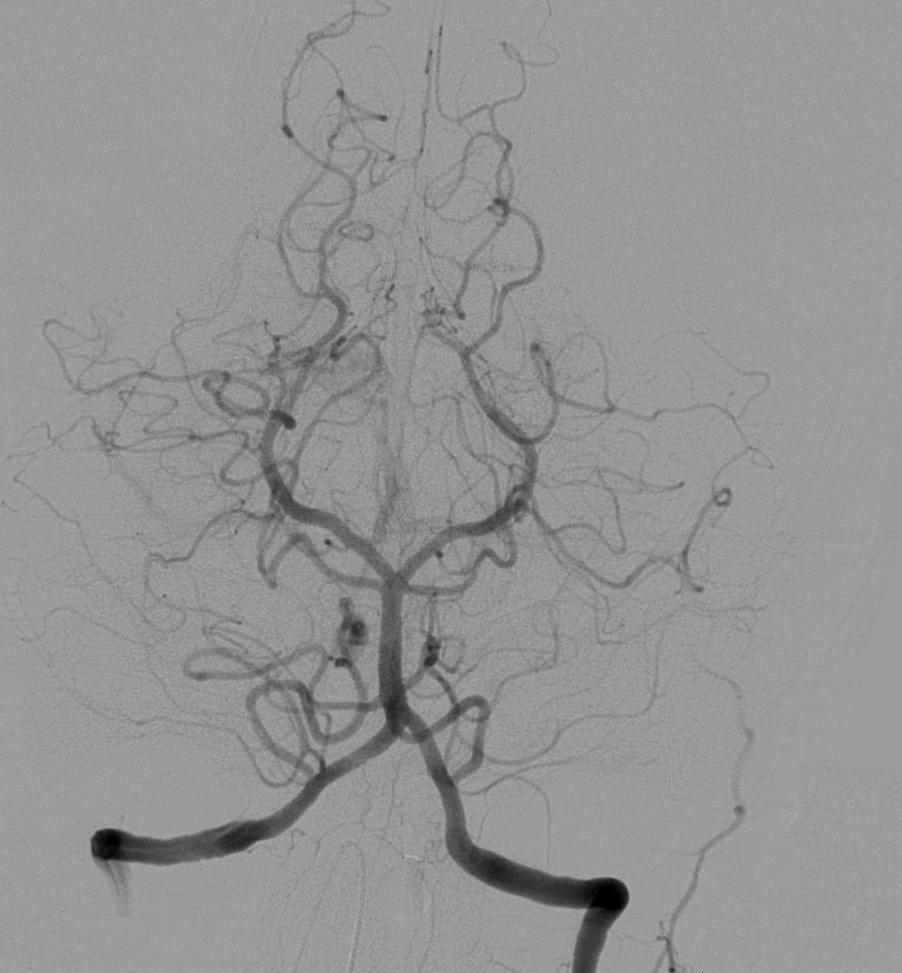
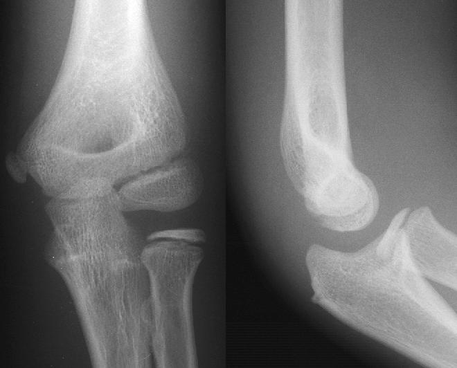

# Image Highlighter
## Author
Alyson Matheus Maruyama Nascimento - 8532269

## Project Description
The main objective of this project is to implement a python code capable of processing grey-scaled images to improve its visibility. In order to achieve that, both **image restoration and colorizing filters** will be applied to the images so that the output images has an better overall visibility, highlighting their most important sections. 

## Application Area
The program should be able to perform well with any grey-scaled image containing distinction of borders and objects to the human eye.  

As an example of medical application, the program must be able to highlight the blood vessels within an [Angiography](https://en.wikipedia.org/wiki/Angiography) or the bones in an [X-Ray](https://en.wikipedia.org/wiki/X-ray) image.

Another application example would be to run the program over X-ray images of vehicles crossing country borders, so that it becomes easier to identify illegal immigrants or criminal drug trafficking.

## Example Images
Although the proper datasets are to be selected yet, the following images are good examples of what kind of input images the program should be able to handle:

| Cerebral Angiography | Lateral Elbow Radiography | Illegal Drugs |
| --- | --- | --- | 
|||  |
