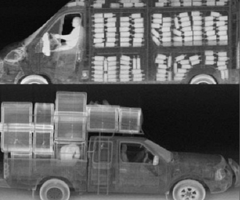

# Image Highlighter
## Author
Alyson Matheus Maruyama Nascimento - 8532269

## Project Description
The main objective of this project is to implement a python code capable of processing grey-scaled images to improve its visibility. In order to achieve that, both **image restoration and colorizing filters** will be applied to the images so that the output images has an better overall visibility, highlighting their most important sections. 

## Application Area
The program should be able to perform well with any grey-scaled image containing distinction of borders and objects to the human eye.  

As an example of medical application, the program must be able to highlight the blood vessels within an [Angiography](https://en.wikipedia.org/wiki/Angiography) or the bones in an [X-Ray](https://en.wikipedia.org/wiki/X-ray) image.

Another application example would be to run the program over X-ray images of vehicles crossing country borders, so that it becomes easier to identify illegal immigrants or criminal drug trafficking.

## Example Images
The following images are good examples of what kind of input images the program should be able to handle:

| Cerebral Angiography | Lateral Elbow Radiography | Illegal Drugs |
| --- | --- | --- | 
|||  |

## Main Objective
As briefly described before, the main objective of this project is to implement a Python program that will apply image processing techniques 
in order to improve visibility of the original image.

Although the objective is to create a generic program that will be able to handle any grayscale image, the Datasets used by this repository
consist only by X-Ray images.

## Datasets
In this project, we use two kind of images: the first one consists in chest X-Rays from patients affected by COVID-19's suffering from pneumonia, while the second one consists in X-Rays from hands.

Both of them were downloaded from **Kaggle.com**: a website that offers open and free datasets and machine learning projects.

The selected datasets can be found in the following links:
- COVID-19 Radiography: https://www.kaggle.com/tawsifurrahman/covid19-radiography-database?
- Hand Bone Age: https://www.kaggle.com/kmader/rsna-bone-age/data?

**Here are some examples:**

 

  
  
 

# How it Works
> **NOTE:** when running the program, the user must specify what filters to be applied in each step

### Step 1
The first step is to apply some Smoothing filter to the original image in order to reduce possible noises. This repository implements 2 filters of this type:

1. [Median Filter](https://en.wikipedia.org/wiki/Median_filter)
2. [Gaussian Filter](https://en.wikipedia.org/wiki/Gaussian_filter)

### Step 2
After that, using the pre-processed image from the step before, in order to improve overall visibility of the image, we apply some Edge Detection filter.  
The user can select one of the following:

1. [Laplacian of Gaussian](https://homepages.inf.ed.ac.uk/rbf/HIPR2/log.htm)
1. [Sobel Operator](https://en.wikipedia.org/wiki/Sobel_operator)

>**NOTE:** For the last one (Sobel Operator), the program will apply a default `scalar` value to the normalized output image in order to increase white pixels intensity
