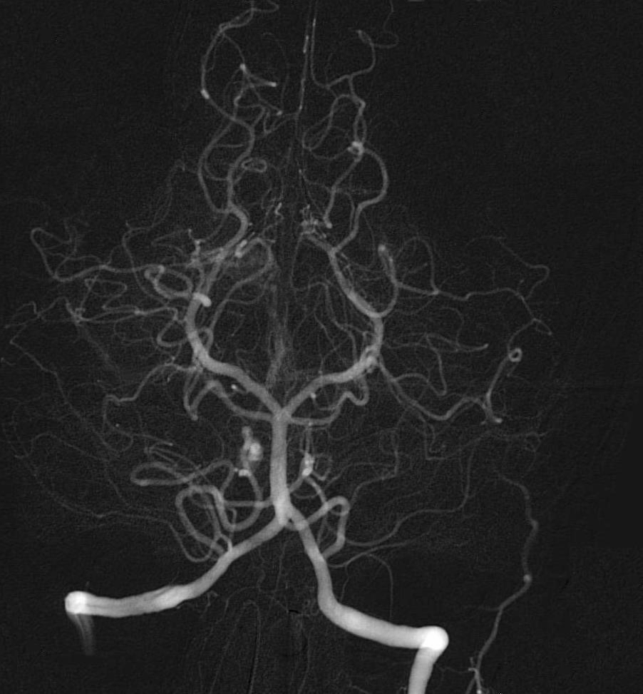

# Image Highlighter
## Author
Alyson Matheus Maruyama Nascimento - 8532269

# Proposal
## Project Description
The main objective of this project is to implement a python code capable of processing gray-scaled images to improve its visibility. In order to achieve that, both **image restoration and colorizing filters** will be applied to the images so that the output images has an better overall visibility, highlighting their most important sections. 

The program runs these steps before returning the output image:
1. Applies a smoothing filter to the image, denoising it
2. Applies edge detection filters
3. Applies a colorizing filters (optional)

All the filters applied are selected by the user, and all the filters available, for each step, are listed in [Available Filters](#Available-Filters) section

## Application Area
The program should be able to perform well with any gray-scaled image containing distinct borders to the human eye.  

As an example of medical application, the program must be able to highlight the blood vessels within an [Angiography](https://en.wikipedia.org/wiki/Angiography) or the bones in a [X-Ray](https://en.wikipedia.org/wiki/X-ray) image.

## Example Images
The following images are good examples of what kind of input images the program should be able to handle:

| Cerebral Angiography | Lateral Elbow Radiography | Illegal Drugs |
| --- | --- | --- | 
|||  |

# Partial Report
## Main Objective
As briefly described before, the main objective of this project is to implement a Python program that will apply image processing techniques 
in order to improve visibility of the original image.

Although the objective is to create a generic program that will be able to handle any grayscale image, the Datasets used by this repository
consist only by X-Ray images.

## Datasets
In this project, we use two kind of images: the first one consists in chest X-Rays from patients affected by COVID-19's suffering from pneumonia, while the second one consists in X-Rays from hands.

Both of them were downloaded from **Kaggle.com**: a website that offers open and free datasets and machine learning projects.

The selected datasets can be found in the following links:
- COVID-19 Radiography: https://www.kaggle.com/tawsifurrahman/covid19-radiography-database?
- Hand Bone Age: https://www.kaggle.com/kmader/rsna-bone-age/data?

**Here are some examples:**

 

  
  
 

# How it Works
> **NOTE:** when running the program, the user must specify what filters to be applied in each step. The Jupyter Notebook **demo**, in the other hand, contains a preset of hardcoded inputs to demonstrate how the program should be used.

## Available Filters
The following table lists all available filters for each step:

|**Step**|**Filters**|
|--|--|
|**1. Smoothing**|1. Median Filter   2. Gaussian Filter|
|**2. Edge Detection** | 1. Laplacian of Gaussian   2. Sobel Operator|
|**3. Colorizing**| 0. None (no colormaps will be applied)   1. Hot  2. Inferno   3. Twilight   4. Rainbow   5. Jet |

### Step 1 - Image Enhancement
The first step is to apply some Smoothing filter to the original image in order to reduce possible existing noises. This repository implements 2 filters of this type:

1. Median Filter [(Read more)](https://en.wikipedia.org/wiki/Median_filter)
2. Gaussian Filter [(Read more)](https://en.wikipedia.org/wiki/Gaussian_filter)

### Step 2 - Edge Detection
After that, using the pre-processed image from the step before, in order to improve overall visibility of the image, we apply some Edge Detection filter.  
The user can select one of the following:

1. Laplacian of Gaussian [(Read more)](https://homepages.inf.ed.ac.uk/rbf/HIPR2/log.htm)
2. Sobel Operator [(Read more)](https://en.wikipedia.org/wiki/Sobel_operator)

>**NOTE:** For the last one (Sobel Operator), the program will apply a default `scalar` value to the normalized output image in order to increase white pixels intensity. Feel free to  change the scalar value, or set it to **1** to disable it and see the raw result from the Sobel filter.

### Step 3 - Normalizing
The program normalizes the image (the implementation of the normalizer function is located at `helpers.py` file)

### Step 4 - Colorizing
In this step the user can pick one of the colormaps to apply to the image in order to colorize it. They are as follows:

0. None (no colormaps will be applied)
1. Hot
2. Inferno
3. Twilight
4. Rainbow
5. Jet

### Step 5 - Showing the Results
The final step is to show the final image.

If you are running the Jupyter Notebook, the output image will be displayed in the own Notebook, alongside with the original image and the results from the **Step 3**, but if you're running the program by the `main.py` file, it should save the output image to the root directory of this project (default file name: `out.png`).

# Examples
The images below represent two types of processing applied to the same image from our dataset:
## After Image Restoration
| Original Image | Gaussian Filter + LoG | Gaussian Filter + Sobel |
| -- | -- | --|
|  |  |  |

Now applying the same filters to an image in our `demo/` folder (containing some random images from the internet):

| Original Image | Gaussian Filter + LoG | Gaussian Filter + Sobel (`scalar=1`) |
| -- | -- | --|
|  |  |  |

## After Colorizing (Inferno colormap)

| Original Image | Gaussian Filter + LoG | Gaussian Filter + Sobel |
| -- | -- | --|
|  |  |  |
|  |  |  |

# Results
The idea of the program is to provide **a set** of filters to be applied to a gray-scaled image. That being said, the program can be used to generate an image resulting of multiple combination of these filters. In this section I describe shortly the main failures and difficulties faced while developing the program.

## Failures
- **Sobel Operator performance**: the way the iterations of the Sobel filter is currently implemented is not optimal. This filter clearly takes longer to be applied than the other ones.
- **Scalar Value(sobel operator)**: when using the Sobel Operator, in most cases even though the algorithm is capable of detecting and highlighting the edges, they are not clearly visible. In order to improve visibility, a `scalar` (constant) is used to multiply the intensity of the pixels, standing out the borders.   
  
  - The above solution does not work perfectly, since each image has better results with different scalar values. This means the value must be manually adjusted for each image.

  - Furthermore, for images with a certain amount a noise, when the scalar is applied the noise also stands out more, and the final image could be totaly ruined.

  |**Ruined Image (`scalar=5`)**| **Good Image (`scalar=5`)**|
  |--|--|
  |  |  |

  As we can see, the first image (*Cerebral Angyography*) was ruined when the scalar value was applied. Both the borders and the noise have their intensities increased, to the point where they mix up together. The same scalar value was applied to the second image (*Hand X-Ray*), but since this one does not contain much noise, it helps to improve the visibility when compared to the raw sobel filter output

- **Colors too bright for some images**

